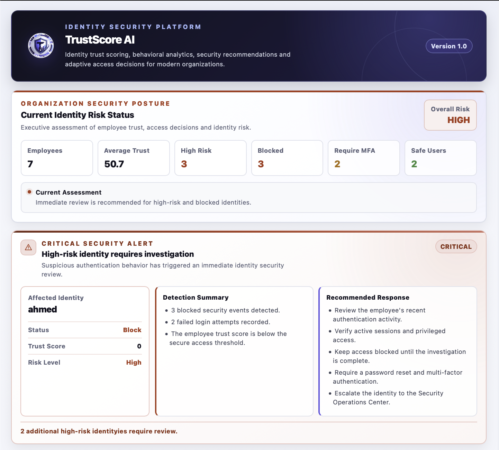

<p align="center">
  
</p>

<h1 align="center">TrustScore AI</h1>

<p align="center">
Hybrid Identity Trust Scoring Platform for Cybersecurity
</p>

<p align="center">
  
</p>

---

Overview

TrustScore AI is a web-based cybersecurity platform for identity risk assessment and dynamic trust evaluation. The platform analyzes identity-related security events, calculates Trust and Risk Scores, and generates explainable access decisions using a hybrid security engine.

The system combines a deterministic Rule-Based Risk Engine with a Random Forest machine learning model. The rule engine produces transparent security decisions based on predefined security indicators, while the machine learning model provides an independent prediction with a confidence score. Both results are combined to generate a final Hybrid Decision that supports identity protection and access control.

The project was developed using FastAPI for the backend, React for the frontend, and SQLite as the database.

---

Main Features

- Dynamic Trust Score Engine
- Rule-Based Identity Risk Assessment
- Random Forest Risk Prediction
- Hybrid Decision Engine
- Explainable Security Decisions
- Model Confidence Score
- Manual Review Detection
- Executive Security Dashboard
- Critical Alert Center
- Employee Trust Monitoring
- Security Event Simulator

---

Technology Stack

Backend

- FastAPI
- SQLAlchemy
- SQLite
- Scikit-learn

Frontend

- React
- Vite
- Axios
- Chart.js

---

System Architecture

```
React Frontend
        │
FastAPI REST API
        │
Hybrid Decision Engine
   ├── Rule-Based Risk Engine
   └── Random Forest Model
        │
Trust Score Engine
        │
SQLite Database
```

---

Hybrid Decision Engine

The platform evaluates every identity event using two independent approaches:

- Rule-Based Risk Engine
- Random Forest Machine Learning Model

The rule engine evaluates security indicators such as failed logins, new devices, VPN usage, login location, and privileged accounts.

The Random Forest model predicts the expected access decision and provides a confidence score.

If both engines agree, the decision is confirmed.

If the engines disagree, the event is flagged for manual review.

---

Future Work

Future improvements include:

- Enterprise Identity Provider integration
- SIEM integration
- Real-time threat intelligence
- Automated security response
- Continuous model retraining

---

Author

Lujain

M.Sc. Cybersecurity